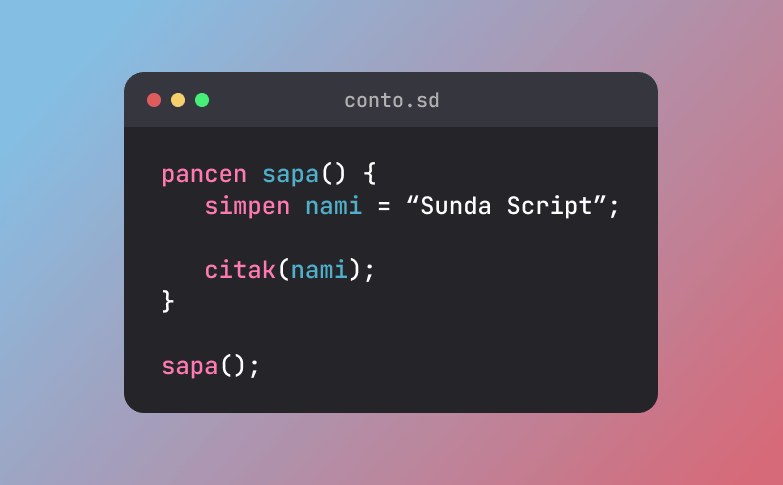
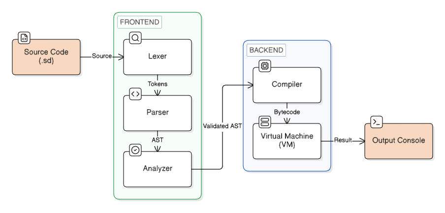

# Sunda Script



[](https://github.com/itskuswandi/sunda-script)
[](https://www.rust-lang.org)
[](https://opensource.org/licenses/MIT)
[](https://sunda-script.netlify.app)

**Sunda Script** adalah bahasa pemrograman prosedural dan dinamis (_dynamically-typed_) yang menggunakan **Bahasa Sunda** sebagai fondasi sintaksis dan kata kuncinya (_keywords_).

Sunda Script bukanlah sekadar bahasa lelucon (_esoteric/joke language_) atau transpiler sederhana yang sekadar menerjemahkan teks ke bahasa pemrograman lain. Ini adalah implementasi bahasa pemrograman _Turing-complete_ yang dibangun sepenuhnya dari nol (_from scratch_) menggunakan [Rust](https://rust-lang.org).

Sunda Script ditenagai oleh mesin eksekusi mandiri yang tangguh. Setiap baris kode yang Anda tulis akan diproses melalui tahapan kompilasi berstandar industri, diubah menjadi _bytecode_ tingkat rendah, dan dieksekusi secara instan oleh _Stack-based Virtual Machine_ (_VM_) yang dirancang khusus untuk bahasa ini. Proyek ini hadir sebagai wujud eksplorasi mendalam terhadap _Compiler Design_ sekaligus merayakan kearifan lokal di panggung teknologi.

## Daftar Isi

- [Filosofi & Arsitektur](#filosofi--Arsitektur)
- [Fitur Utama](#fitur-utama)
- [Panduan Instalasi](#panduan-instalasi)
- [Panduan Sintaks](#panduan-sintaks)
- [Kamus Kata Kunci](#kamus-kata-kunci)
- [Referensi API](#referensi-api)
- [Contoh Program](#contoh-program)
- [Pelaporan Eror](#pelaporan-eror)
- [Cara Berkontribusi](#cara-berkontribusi)
- [Pengembang](#pengembang)
- [Lisensi](#lisensi)

## Filosofi & Arsitektur

Sunda Script bukan sekadar proyek eksperimental, melainkan dibangun di atas fondasi arsitektur kompilator standar industri (_Compiler/Interpreter Design_). Sistem ini mengadopsi prinsip _Separation of Concerns_ (pemisahan tugas) secara tegas menjadi dua kompartemen utama (_frontend_ dan _backend_). Pendekatan ini menjamin skalabilitas, kemudahan pemeliharaan (maintainability), dan performa eksekusi tingkat tinggi.



### 1. Frontend (Penganalisis)

Fase ini bertindak sebagai "otak analitik" yang bertugas membaca, mengurai struktur logika, dan memvalidasi keabsahan sintaks dari setiap baris teks yang Anda tulis.

- **Lexer**

  Bertugas memindai kode sumber mentah karakter demi karakter, lalu mengelompokkannya menjadi unit dasar bermakna yang disebut _Token_ (seperti kata kunci, angka, teks, dan simbol operator).

- **Parser**

  Mengonstruksi struktur pohon logika atau _Abstract Syntax Tree_ (_AST_) dari barisan _token_. Fase ini diimplementasikan menggunakan teknik _Top-Down Operator Precedence_ (_Pratt Parsing_) yang sangat efisien dan tangguh dalam mengevaluasi hierarki serta prioritas operasi matematika kompleks (BODMAS/KABATAKU).

- **Analyzer**

  Bertindak sebagai penjaga gerbang logika sebelum program dieksekusi. Fase ini secara ketat menganalisis _scope_ (ruang lingkup memori), mencegah penggunaan variabel yang belum dideklarasikan, serta memvalidasi keabsahan konteks alur kontrol program.

### 2. Backend (Eksekutor)

Setelah kode terbukti valid dan aman secara semantik, fase ini mengambil alih untuk mentransformasikan logika tersebut ke dalam format instruksi yang efisien dan mengeksekusinya dengan kecepatan maksimal.

- **Compiler**

  Mentransformasi _Abstract Syntax Tree_ (_AST_) yang kompleks menjadi barisan instruksi operasional tingkat rendah (_Bytecode_). Fase ini secara cerdas menyederhanakan logika hierarkis program menjadi urutan perintah linier yang sangat ringkas dan optimal.

- **Virtual Machine**

  Bertindak sebagai jantung pengeksekusi program. Mesin virtual ini membaca dan menjalankan instruksi _bytecode_ secara instan menggunakan arsitektur evaluasi berbasis tumpukan (_stack-based_), mengambil inspirasi desain langsung dari implementasi bahasa standar industri kelas berat seperti _JVM_, _CPython_, dan _Lua_.

## Fitur Utama

Sunda Script memadukan kearifan budaya lokal dengan standar rekayasa perangkat lunak modern. Berikut adalah beberapa fitur unggulannya:

- 💬 **Sintaks dengan Kearifan Lokal**

  Seluruh sintaks dan kata kunci utama menggunakan bahasa Sunda, membuktikan bahwa bahasa daerah dapat diintegrasikan dengan baik ke dalam instruksi komputasi modern.

- ⚙️ **Arsitektur VM Mandiri**

  Beroperasi di atas instruksi _bytecode_ dan dieksekusi secara langsung oleh mesin virtual bawaan. Abstraksi memori yang dioptimalkan memastikan performa eksekusi tetap cepat.

- 🧠 **Sistem Parsing Tingkat Lanjut**

  Mengimplementasikan algoritma _Top-Down Operator Precedence_ untuk mengurai ekspresi matematika dan logika relasional secara akurat sesuai dengan standar matematika universal.

- 🧩 **First-Class Functions dan Tipe Data Majemuk**

  Mendukung struktur data dinamis, termasuk _Array_ dan _Object_ bersarang. Fungsi diperlakukan sebagai _First-Class Citizens_, yang memungkinkan pembuatan _Higher-Order Functions_ langsung dari tingkat _Virtual Machine_.

- 🛡️ **Scope yang Aman**

  Dilengkapi arsitektur _Call Stack_ tersendiri. Sistem ini menjamin isolasi _scope_ antar blok fungsi dan mendukung pemanggilan rekursif secara aman tanpa risiko pencemaran memori global (_global memory pollution_).

- ☕ **Developer Experience yang Baik**

  Kompilator dirancang untuk memberikan umpan balik yang konstruktif. Pesan eror dikategorikan dengan jelas (_Lepat Maca_, _Lepat Sintaks_, _Lepat Semantik_), memberikan koordinat baris dan kolom yang akurat, serta disajikan dengan bahasa Sunda yang sopan.

## Panduan Instalasi

Sunda Script dikembangkan menggunakan bahasa Rust. Pastikan sistem Anda telah memiliki [Rust](https://rust-lang.org) dan package manager [Cargo](https://rust-lang.org/tools/install) sebelum memulai instalasi.

### 1. Kloning Repositori

Unduh _source code_ proyek ini melalui terminal:

```bash
git clone https://github.com/itskuswandi/sunda-script.git

cd sunda-script
```

### 2. Persiapkan File Program

Buat sebuah file teks dengan ekstensi `.sd` (misalnya `conto.sd`) di dalam direktori `examples/`, atau gunakan file contoh yang telah disediakan.

### 3. Menjalankan Program

Terdapat dua opsi pengeksekusian yang dapat disesuaikan dengan kebutuhan pengembangan:

#### Opsi A: Mode _Development_ (Untuk Pengujian)

Mode ini ideal digunakan pada tahap pengembangan. Perintah `cargo run` akan secara otomatis mengompilasi _interpreter_ sekaligus mengeksekusi skrip Anda.

```bash
cargo run examples/conto.sd
```

#### Opsi B: Mode _Production_ (Untuk Performa Maksimal)

Untuk mendapatkan performa eksekusi terbaik dengan optimasi kompilator _Rust_, disarankan untuk melakukan _build_ ke versi rilis.

```bash
# 1. Kompilasi interpreter menjadi binary yang teroptimasi
cargo build --release

# 2. Eksekusi skrip menggunakan binary rilis
./target/release/sunda-script examples/conto.sd
```

## Panduan Sintaks

Bagi pengembang yang terbiasa dengan bahasa berorientasi blok (_block-structured_) seperti _C_, _Java_, atau _JavaScript_, adaptasi sintaks Sunda Script akan terasa sangat intuitif. Berikut adalah panduan dasarnya:

### 1. Variabel & Tipe Data

Sunda Script menerapkan pengetikan dinamis (_dynamic typing_). Anda cukup menggunakan kata kunci `simpen` untuk mendeklarasikan variabel baru. Mesin kompilator akan secara otomatis mengidentifikasi dan mengelola alokasi tipe data di memori saat eksekusi berlangsung.

```javascript
simpen nami = "Ujang Sutisna";  // Teks (String)
simpen umur = 25;               // Angka Bulat (Integer)
simpen beurat = 65.5;           // Angka Desimal (Float)
simpen kasep = leres;           // Boolean (leres = true, lepat = false)
simpen status = kosong;         // Null (Kosong)

// Penggabungan string dan konversi tipe dinamis dengan .janten_teks()
citak("Nami abdi " + nami + ", yuswa " + umur.janten_teks() + " taun.");
```

### 2. Struktur Data Majemuk (Array & Object)

Bahasa ini mendukung penuh penggunaan struktur data majemuk. Anda dapat menggunakan Daptar (_Array_) untuk menyimpan koleksi data berurutan, dan Kamus (_Object_) untuk penyimpanan data berbasis kunci-nilai (_key-value_). Keduanya bersifat dinamis dan elemennya dapat dimodifikasi kapan saja.

```javascript
// Daptar (Array) - Koleksi data sekuensial
simpen rerencangan = ["Asep", "Jajang"];
rerencangan.tambih_pengker("Eulis");      // Menambahkan elemen ke akhir array
citak("Rerencangan kahiji: " + rerencangan[0]);

// Kamus (Object) - Koleksi pasangan Kunci-Nilai (Key-Value)
simpen profil = {
    nami: "Kabayan",
    asal: "Desa Sukamaju",
    umur: 30
};
profil.umur = 31;                         // Pembaruan properti
citak(profil.nami + " ti " + profil.asal);
```

### 3. Kontrol Alur (Percabangan Logika)

Pengambilan keputusan dalam alur program ditangani oleh blok `upami` (_if_), `sanes upami` (_else if_), dan `sanes` (_else_). Blok logika ini mendukung evaluasi ekspresi relasional dan operator logika berantai (`&&`, `||`) secara komprehensif.

```javascript
simpen dinten = "Saptu";
simpen artos = 50000;

upami (dinten == "Saptu" && artos >= 100000) {
    citak("Hayu urang ameng ka Bandung!");
} sanes upami (dinten == "Saptu" || dinten == "Minggon") {
    citak("Artosna kirang, ameng di lembur wae.");
} sanes {
    citak("Dinten damel, kedah sumanget!");
}
```

### 4. Perulangan (Iterasi)

Sunda Script menyediakan dua mekanisme perulangan. Gunakan `ngulang` untuk perulangan iteratif yang bergantung pada kondisi bernilai logika leres/benar. Sedangkan `pikeun` ideal untuk iterasi numerik yang lebih terstruktur. Anda juga dapat mengontrol putaran menggunakan interupsi `liren` (_break_) dan `lajeungkeun` (_continue_).

```javascript
// Iterasi berbasis kondisi dinamis (While)
simpen tanaga = 3;
ngulang (tanaga > 0) {
    citak("Nuju damel... Sesa tanaga: " + tanaga.janten_teks());
    tanaga = tanaga - 1;
}

// Iterasi terstruktur (For)
pikeun (simpen x = 1; x <= 5; x = x + 1) {
    upami (x == 2) {
        lajeungkeun; // Melewati iterasi saat ini
    }
    upami (x == 5) {
        liren;       // Menghentikan eksekusi perulangan secara paksa
    }
    citak("Iterasi ka-" + x.janten_teks());
}
```

### 5. Fungsi

Modularitas kode dicapai melalui deklarasi fungsi menggunakan kata kunci `pancen`. Setiap fungsi dieksekusi dalam ruang lingkup memori (_scope_) tersendiri di dalam _Call Stack_, sehingga variabel lokal di dalamnya terisolasi dengan aman dari _state global_. Gunakan `wangsul` untuk mengembalikan hasil operasi fungsi.

```javascript
// Pendefinisian fungsi dengan parameter dan pengembalian nilai (return)
pancen diskon(harga, potongan) {
    simpen total_potongan = harga * (potongan / 100);
    wangsul harga - total_potongan;
}

simpen harga_sapatu = 200000;
simpen harga_ahir = diskon(harga_sapatu, 20);

citak("Harga sapatu sabada diskon: Rp" + harga_ahir.janten_teks());
```

## Kamus Kata Kunci

Untuk mempermudah pemahaman sintaks, berikut adalah tabel pemetaan kata kunci dari bahasa pemrograman standar ke Sunda Script:

| Bahasa Standar | Sunda Script      | Deskripsi Fungsional                                                            |
| -------------- | ----------------- | ------------------------------------------------------------------------------- |
| `var` / `let`  | `simpen`          | Mendeklarasikan variabel baru dan menyimpan nilainya di memori.                 |
| `function`     | `pancen`          | Mendefinisikan blok fungsi modular.                                             |
| `return`       | `wangsul`         | Mengembalikan nilai dari fungsi ke pemanggil (_caller_).                        |
| `print`        | `citak`           | Menampilkan output teks atau data ke terminal (_stdout_).                       |
| `if`           | `upami`           | Menginisiasi blok evaluasi percabangan kondisional.                             |
| `else if`      | `sanes upami`     | Menambahkan kondisi alternatif apabila kondisi sebelumnya bernilai lepat/salah. |
| `else`         | `sanes`           | Menjalankan eksekusi _default_ apabila semua kondisi di atasnya lepat/salah.    |
| `while`        | `ngulang`         | Mengeksekusi perulangan secara kontinu selama kondisi bernilai leres/benar.     |
| `for`          | `pikeun`          | Menjalankan perulangan numerik yang terstruktur.                                |
| `break`        | `liren`           | Menginterupsi dan keluar dari blok perulangan secara paksa.                     |
| `continue`     | `lajeungkeun`     | Melewati putaran perulangan saat ini dan melanjutkan ke iterasi berikutnya.     |
| `true`/`false` | `leres` / `lepat` | Nilai _Boolean_ (merepresentasikan benar atau salah).                           |
| `null`         | `kosong`          | Merepresentasikan ketiadaan referensi atau data kosong.                         |

## Referensi API

Sunda Script dilengkapi dengan _Native Methods_ (fungsi bawaan) yang terintegrasi pada _Virtual Machine_ Rust. Pemanggilan metode dilakukan melalui notasi titik (_dot notation_), misalnya: `variabel.metode()`.

### Teks (String)

| Metode             | Parameter       | Tipe Kembalian | Deskripsi                                                                |
| ------------------ | --------------- | -------------- | ------------------------------------------------------------------------ |
| `aksara_ageung()`  | -               | `String`       | Mengonversi seluruh huruf menjadi kapital.                               |
| `aksara_alit()`    | -               | `String`       | Mengonversi seluruh huruf menjadi huruf kecil.                           |
| `balikkeun()`      | -               | `String`       | Membalikkan urutan karakter pada teks.                                   |
| `gentos()`         | `lami`, `anyar` | `String`       | Mengganti _substring_ `lami` menjadi `anyar`.                            |
| `hurup_ka()`       | `indeks`        | `String`       | Mengembalikan karakter pada `indeks` tertentu.                           |
| `janten_angka()`   | -               | `Integer`      | Mengonversi teks menjadi Angka Bulat (_Integer_).                        |
| `janten_desimal()` | -               | `Float`        | Mengonversi teks menjadi Angka Desimal (_Float_).                        |
| `ngandung()`       | `teks`          | `Boolean`      | Memvalidasi keberadaan `teks` tertentu (mengembalikan _boolean_).        |
| `panjang()`        | -               | `Integer`      | Mengembalikan jumlah karakter pada teks.                                 |
| `pisahkeun()`      | `pamisa`        | `Array`        | Memecah teks menjadi _Array_ berdasarkan parameter pemisah.              |
| `posisi_ka()`      | `teks`          | `Integer`      | Mencari indeks pertama dari teks yang dicari (-1 jika tidak ditemukan).  |
| `potong()`         | `awal`, `akhir` | `String`       | Memotong teks berdasarkan indeks `awal` hingga `akhir`.                  |
| `rapikeun()`       | -               | `String`       | Menghapus karakter spasi berlebih (_whitespace_) di awal dan akhir teks. |

### Angka Bulat (Integer)

| Metode             | Parameter    | Tipe Kembalian | Deskripsi                                                         |
| ------------------ | ------------ | -------------- | ----------------------------------------------------------------- |
| `janten_desimal()` | -            | `Float`        | Mengonversi Angka Bulat menjadi Angka Desimal.                    |
| `janten_teks()`    | -            | `String`       | Mengonversi angka menjadi format teks (_String casting_).         |
| `mutlak()`         | -            | `Integer`      | Mengembalikan nilai absolut (_Absolute value_).                   |
| `watesan()`        | `min`, `max` | `Integer`      | Membatasi angka agar selalu berada dalam rentang `min` dan `max`. |

### Angka Desimal (Float)

| Metode          | Parameter    | Tipe Kembalian | Deskripsi                                                          |
| --------------- | ------------ | -------------- | ------------------------------------------------------------------ |
| `buleudkeun()`  | -            | `Integer`      | Membulatkan angka desimal ke nilai terdekat (_Round_).             |
| `janten_teks()` | -            | `String`       | Mengonversi angka menjadi format teks (_String casting_).          |
| `ka_handap()`   | -            | `Integer`      | Membulatkan angka secara mutlak ke bawah (_Floor_).                |
| `ka_luhur()`    | -            | `Integer`      | Membulatkan angka secara mutlak ke atas (_Ceil_).                  |
| `mutlak()`      | -            | `Float`        | Mengembalikan nilai absolut (_Absolute value_).                    |
| `watesan()`     | `min`, `max` | `Float`        | Membatasi angka desimal agar berada dalam rentang `min` dan `max`. |

### Daptar (Array)

| Metode             | Parameter       | Tipe Kembalian | Deskripsi                                                           |
| ------------------ | --------------- | -------------- | ------------------------------------------------------------------- |
| `balikkeun()`      | -               | `Null`         | Membalik urutan elemen dalam _Array_ (mutasi data asli).            |
| `candak_payun()`   | -               | `Any`          | Menghapus dan mengembalikan elemen pertama dari _Array_ (_Shift_).  |
| `candak_pengker()` | -               | `Any`          | Menghapus dan mengembalikan elemen terakhir dari _Array_ (_Pop_).   |
| `gabungkeun()`     | `pamisa`        | `String`       | Menyatukan elemen-elemen _array_ menjadi _string_ tunggal.          |
| `milari()`         | `pancen`        | `Any`          | Mengembalikan elemen pertama yang lolos fungsi evaluasi _callback_. |
| `panjang()`        | -               | `Integer`      | Mengembalikan total jumlah elemen pada _Array_.                     |
| `petakeun()`       | `pancen`        | `Array`        | Membuat _Array_ baru hasil pemetaan fungsi _callback_ (_Map_).      |
| `posisi_ka()`      | `nilai`         | `Integer`      | Mengembalikan indeks elemen tertentu (-1 jika tidak ditemukan).     |
| `potong()`         | `awal`, `akhir` | `Array`        | Membuat _Array_ baru dari potongan indeks `awal` hingga `akhir`.    |
| `saring()`         | `pancen`        | `Array`        | Memfilter _Array_ berdasarkan evaluasi _callback_ (_Filter_).       |
| `susun()`          | -               | `Null`         | Mengurutkan elemen secara _ascending_ (mutasi data asli).           |
| `tambih_payun()`   | `nilai`         | `Null`         | Menyisipkan data baru pada indeks pertama (_Unshift_).              |
| `tambih_pengker()` | `nilai`         | `Null`         | Menambahkan data baru pada indeks terakhir (_Push_).                |
| `unggal()`         | `pancen`        | `Null`         | Mengeksekusi fungsi _callback_ untuk setiap elemen _Array_.         |

### Kamus (Object)

| Metode         | Parameter | Tipe Kembalian | Deskripsi                                                      |
| -------------- | --------- | -------------- | -------------------------------------------------------------- |
| `eusi()`       | -         | `Array`        | Mengembalikan daftar seluruh _value_ (nilai) dari dalam objek. |
| `jumlah()`     | -         | `Integer`      | Mengembalikan total jumlah properti yang ada di dalam objek.   |
| `konci()`      | -         | `Array`        | Mengembalikan daftar seluruh _key_ (kunci) dari dalam objek.   |
| `ngagaduhan()` | `konci`   | `Boolean`      | Memvalidasi apakah objek memiliki `konci` properti tertentu.   |
| `piceun()`     | `konci`   | `Any`          | Menghapus dan mengembalikan properti tertentu dari objek.      |

## Contoh Program

Untuk mendemonstrasikan keandalan _Virtual Machine_ Sunda Script, berikut adalah beberapa implementasi pemrograman standar:

### 1. Evaluasi Ekspresi & Kontrol Alur (_FizzBuzz_)

Implementasi ini membuktikan kemampuan _Pratt Parser_ dalam menangani operasi modulo (`%`), relasional (`==`), serta percabangan majemuk.

```javascript
citak("=== Program FizzBuzz ===");

pikeun (simpen i = 1; i <= 15; i = i + 1) {
    // Evaluasi operator logika AND
    upami (i % 3 == 0 && i % 5 == 0) {
        citak("FizzBuzz");
    } sanes upami (i % 3 == 0) {
        citak("Fizz");
    } sanes upami (i % 5 == 0) {
        citak("Buzz");
    } sanes {
        citak(i);
    }
}
```

Output Terminal:

```text
=== Program FizzBuzz ===
1
2
Fizz
4
Buzz
Fizz
7
8
Fizz
Buzz
11
Fizz
13
14
FizzBuzz
```

### 2. Rekursi & Manajemen _Call Stack_ (_Deret Fibonacci_)

Mesin virtual Sunda Script memiliki manajemen _Call Stack_ tersendiri yang mumpuni. Fungsi dapat memanggil dirinya sendiri secara aman tanpa terjadi bentrokan status memori (_state collision_).

```javascript
citak("=== Deret Fibonacci Rekursif ===");

pancen fibonacci(n) {
    // Base case: Pencegahan loop tak terbatas
    upami (n <= 1) {
        wangsul n;
    }

    // Pemanggilan rekursif
    wangsul fibonacci(n - 1) + fibonacci(n - 2);
}

citak("Milarian 8 angka kahiji:");
pikeun (simpen i = 0; i < 8; i = i + 1) {
    simpen hasil = fibonacci(i);

    // Casting eksplisit (.janten_teks) untuk penggabungan string
    citak("Angka ka-" + i.janten_teks() + " = " + hasil.janten_teks());
}
```

Output Terminal:

```text
=== Deret Fibonacci Rekursif ===
Milarian 8 angka kahiji:
Angka ka-0 = 0
Angka ka-1 = 1
Angka ka-2 = 1
Angka ka-3 = 2
Angka ka-4 = 3
Angka ka-5 = 5
Angka ka-6 = 8
Angka ka-7 = 13
```

### 3. Pemrograman Fungsional (_Higher-Order Functions_)

Ini merupakan salah satu fitur tingkat lanjut. Karena fungsi diperlakukan sebagai entitas utama (_first-class citizens_), fungsi kustom dapat dilempar (_passed as arguments_) ke dalam metode _Native API_ seperti `.saring()` dan `.petakeun()`.

```javascript
citak("=== Filter & Map Data (HOF) ===");

simpen data = [1, 2, 3, 4, 5, 6, 7, 8];

// 1. Fungsi predikat (digunakan untuk metode Filter)
pancen mung_genap(angka) {
    wangsul angka % 2 == 0;
}

// 2. Fungsi transformasi (digunakan untuk metode Map)
pancen kali_sapuluh(angka) {
    wangsul angka * 10;
}

// 3. Chain eksekusi HOF
simpen data_genap = data.saring(mung_genap);
simpen hasil_ahir = data_genap.petakeun(kali_sapuluh);

citak("Data Asli: " + data.gabungkeun(", "));
citak("Hasil Ahir: " + hasil_ahir.gabungkeun(", "));
```

Output Terminal:

```text
=== Filter & Map Data (HOF) ===
Data Asli: 1, 2, 3, 4, 5, 6, 7, 8
Hasil Ahir: 20, 40, 60, 80
```

## Pelaporan Eror

Sunda Script dirancang dengan memprioritaskan pengalaman pengembang (_Developer Experience_). Jika terdapat kesalahan penulisan atau eror logika, kompilator akan menghentikan eksekusi dan menginformasikan lokasi spesifik secara deskriptif dan terstruktur.

**Representasi Visual Pesan Kesalahan:**

```text
[Lepat Maca | Baris 2, Kolom 5] Hapunten: Diperyogikeun ';' saatos ekspresi.

[Lepat Sintaks | Baris 5, Kolom 10] Hapunten: Diperyogikeun '}' saatos blok kode.

[Lepat Semantik | Baris 8, Kolom 1] Hapunten: Variabel 'nami' parantos didamel.

[Lepat Eksekusi | Baris 10] Hapunten: Teu tiasa ngabagi ku enol.
```

## Cara Berkontribusi

Sunda Script dibangun dengan semangat _open-source_. Proyek ini sangat terbuka untuk kontribusi dari siapa saja. Jika Anda menemukan _bug_, memiliki ide fitur baru, memperbaiki dokumentasi, atau ingin menambahkan contoh program, jangan ragu untuk ikut berkontribusi.

Langkah-langkah kontribusi:

1. **Fork** repositori ini.
2. Buat **Branch** khusus untuk fitur atau perbaikan Anda.
3. Terapkan perubahan, kemudian **Commit** dan **Push** kode Anda.
4. Buka **Pull Request** untuk didiskusikan dan diintegrasikan.

## Pengembang

Sunda Script dikembangkan oleh [Tatang Kuswandi](https://github.com/itskuswandi) sebagai sarana eksplorasi rekayasa dalam pengembangan Kompilator dan _Virtual Machine_ serta pelestarian bahasa daerah di ranah teknologi.

Jika proyek ini bermanfaat atau memberikan inspirasi bagi Anda, mari berikan apresiasi dengan menekan tombol Bintang (⭐) pada repositori ini.

## Lisensi

Proyek ini didistribusikan di bawah lisensi MIT. Anda diizinkan untuk menggunakan, memodifikasi, dan mendistribusikan ulang basis kode ini. Silakan rujuk berkas [LICENSE](LICENSE) untuk detail hukum lebih lanjut.
